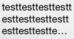

SwiftLabelFitToSize
===================

SwiftLabelFitToSize provides following two extensions for UILabel.

* **fitToSizeByTruncate** - Truncate the text to fit.
* **fitToSizeByReduction** - Reduce the font size to fit.

SwiftLabelFitToSizeは、UILabelを拡張して以下の２つのメソッドを提供します。

* **fitToSizeByTruncate** - ラベルのサイズに合うようにテキストの文字数を削ります。
* **fitToSizeByReduction** - ラベルのサイズに合うようにフォントサイズを小さくします。

## Installation

Add SwiftLabelFitToSize.swift file to your project.

プロジェクトにSwiftLabelFitToSize.swiftファイルを追加してください。

## FitToSizeByTruncate

```swift
func fitToSizeByTruncate(omission:String = "…")
```

* **Description**	Truncate the text to fit.  
* **Parameters**
  * **omission**	String which replace the last characters with. Defaults to '…'

## FitToSizeByReduction

```swift
func fitToSizeByReduction(step:CGFloat = 0.5, minimumSize:CGFloat = 5.0)  
```

* **Description**	Reduce the font size to fit.  
* **Parameters**
  * **step**	Step of reducing font size. Defaults to 0.5
  * **minimumSize**	Minimum size of font size. Defaults to 5.0

## Example Usage

```swift
let label = UILabel(frame: CGRectMake(0, 0, 120, 80))
label.numberOfLines = 0
label.text = "testtesttesttesttesttesttesttesttesttesttesttesttesttesttesttest"
label.fitToSizeByTruncate()
// same: label.fitToSizeByTruncate(omission: "…")
```

## Result


